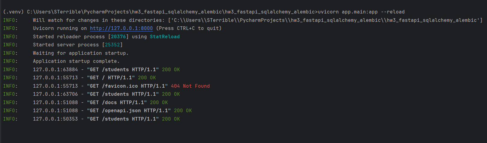
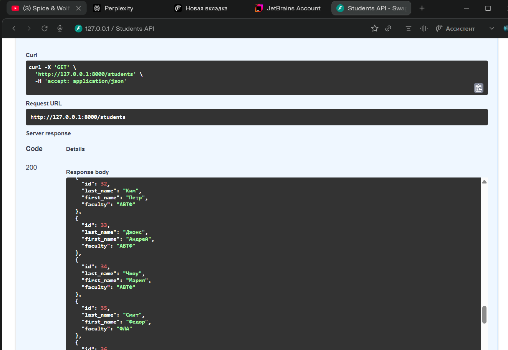
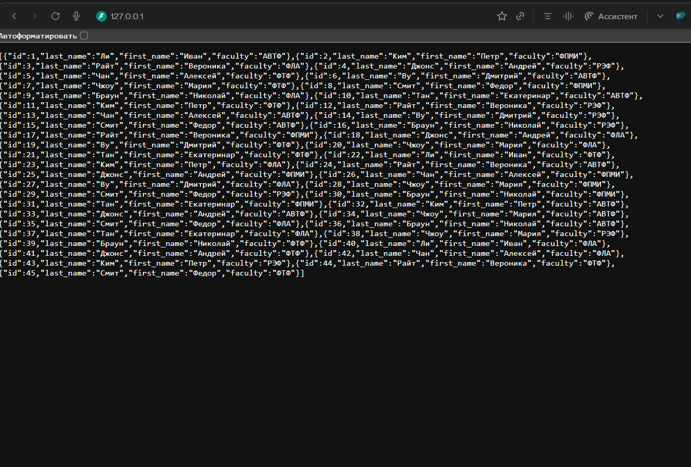

# Домашнее задание 3 — FastAPI, SQLAlchemy, Alembic

Проект реализует модель данных для `students.csv`, миграции Alembic и загрузку данных.

## Структура модели

Данные разделены на 4 таблицы:

- `faculties` — факультеты
- `students` — студенты (`last_name`, `first_name`, `faculty_id`)
- `subjects` — предметы (в CSV столбец `Курс` содержит название предмета)
- `student_grades` — оценка студента по предмету

Ограничения:

- уникальный студент в рамках факультета (`uq_students_full_name_faculty`)
- уникальная пара студент+предмет (`uq_student_subject`)
- диапазон оценки `0..100` (`ck_grade_range`)

Если в CSV встречается дублирующаяся пара студент+предмет, сохраняется последняя оценка.

## Как запустить

```bash
python -m venv .venv
source .venv/bin/activate  # Linux/macOS
pip install -r requirements.txt
alembic upgrade head
python load_students.py
uvicorn app.main:app --reload
```

## Проверка

- `GET /` — сервис запущен
- `GET /students` — список студентов с факультетами
- `GET /docs` — Swagger UI

примеры работы:


